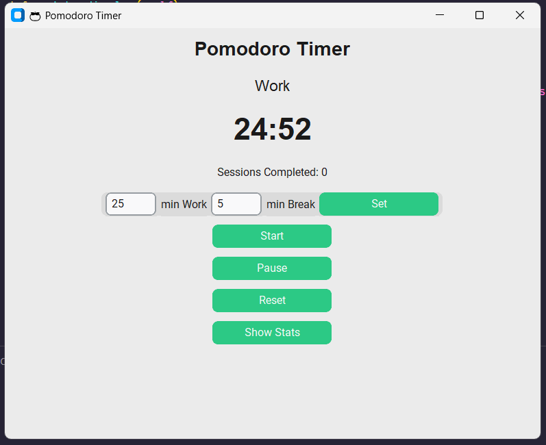

# 🍅 Pomodoro Timer with Stats & Customization

A modern Pomodoro timer built in Python with **CustomTkinter** and **Matplotlib**, featuring:
- Adjustable work/break durations
- Automatic session switching
- Daily statistics visualization
- Session sound alerts

## Features
✅ Start, pause, and reset sessions  
✅ Customize work & break lengths directly from the UI  
✅ Automatic tracking of sessions per day  
✅ Matplotlib charts of your productivity  
✅ Sound alerts when sessions end  

## Installation
```bash
git clone https://github.com/atharvtkn/simple-pomodoro-timer.git
cd simple-pomodoro-timer
pip install -r requirements.txt
```

## Usage
```bash
python maingui.py
```

## Screenshot

